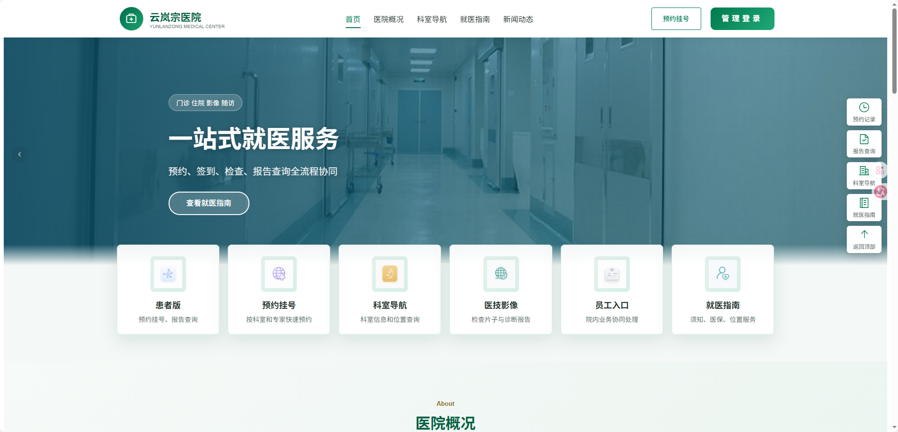
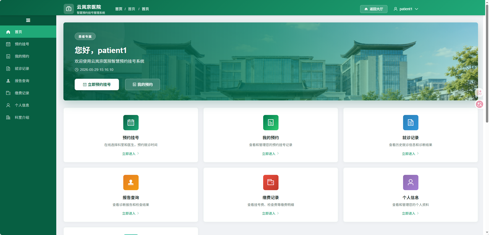
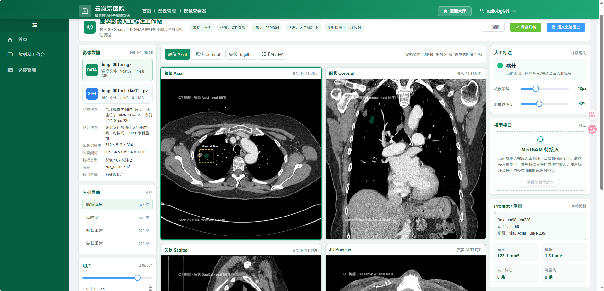

# 医院管理系统 (Hospital Management System)

[](LICENSE)
[](https://www.java.com/)
[](https://vuejs.org/)
[](https://spring.io/projects/spring-boot)
[](https://www.python.org/)

一个现代化的医院管理系统，集成医学影像管理、AI 辅助诊断、人工标注工具、预约挂号等功能，支持四角色权限隔离。

---

## 目录

- [功能特性](#功能特性)
- [系统架构](#系统架构)
- [技术栈](#技术栈)
- [环境要求](#环境要求)
- [快速开始](#快速开始)
- [测试账号](#测试账号)
- [项目结构](#项目结构)
- [数据库设计](#数据库设计)
- [API 接口文档](#api-接口文档)
- [各角色功能说明](#各角色功能说明)
- [开发指南](#开发指南)
- [常见问题](#常见问题)
- [License](#license)

---

## 功能特性

### 四角色权限系统

| 角色 | 说明 | 主要功能 |
|------|------|---------|
| **管理员** | 系统管理 | 医院管理、科室管理、医生管理、患者管理、影像管理、诊断管理、排版管理 |
| **主治医生** | 临床诊断 | 患者预约管理、出诊计划、影像查看、诊断报告撰写 |
| **放射科医生** | 影像诊断 | 放射科工作台、影像查看器、人工标注（框选/画笔/擦除）、AI 辅助分割、诊断报告 |
| **患者** | 就医服务 | 预约挂号、查看预约、就诊记录、报告查询、缴费记录、科室介绍、个人信息 |

### 核心功能模块

- **医学影像查看器** — 支持 DICOM 格式影像浏览，多系列/切片切换，Canvas 渲染 + 遮罩层叠加
- **人工标注工具** — 框选（矩形）、画笔（自由绘制）、擦除、撤销/重做，标注数据持久化存储
- **AI 辅助分割** — MedSAM (Segment Anything) 模型集成，一键分割病灶区域（预留接口）
- **诊断报告系统** — 报告创建/编辑/审核，关联影像资料，支持草稿/已提交/已审核状态流转
- **预约挂号系统** — 多步骤向导（选科室→选医生→选时间→确认），支持取消预约
- **出诊计划管理** — 医生排班、门诊时段配置
- **权限管理** — 基于 RBAC 的菜单/资源/角色权限控制，JWT 令牌认证

---

## 系统架构

```
┌─────────────────────────────────────────────────────────────────┐
│                        前端 (Vue 2.5)                           │
│  ┌──────────┐ ┌──────────┐ ┌──────────┐ ┌──────────┐           │
│  │ 管理员端  │ │ 医生端   │ │ 放射科端  │ │ 患者端   │           │
│  └────┬─────┘ └────┬─────┘ └────┬─────┘ └────┬─────┘           │
│       └────────────┴────────────┴────────────┘                  │
│                          │  Element UI + Vue Router + Vuex      │
└──────────────────────────┼──────────────────────────────────────┘
                           │ HTTP (JWT Auth)
┌──────────────────────────┼──────────────────────────────────────┐
│                    后端 (Spring Boot 2.1.6)                     │
│  ┌───────────────────────┴───────────────────────────┐          │
│  │            Spring Security + JWT 认证              │          │
│  ├──────────┬──────────┬──────────┬──────────────────┤          │
│  │ 控制器层  │  服务层   │ 数据层   │   实体层         │          │
│  │Controller│ Service  │ Mapper  │   Entity         │          │
│  └──────────┴────┬─────┴────┬────┘   └──────────────┘          │
│                  │          │                                    │
│            ┌─────┴───┐ ┌───┴──────┐                             │
│            │  MySQL 8 │ │  Redis   │                             │
│            └─────────┘ └──────────┘                             │
└─────────────────────────────────────────────────────────────────┘
                           │
┌──────────────────────────┼──────────────────────────────────────┐
│                  AI 服务 (Python Flask)                         │
│  ┌───────────────────────┴───────────────────────────┐          │
│  │           MedSAM (Segment Anything)               │          │
│  │         医学图像分割模型 (预留接口)                  │          │
│  └───────────────────────────────────────────────────┘          │
└─────────────────────────────────────────────────────────────────┘
```

---

## 前端界面展示

### 大厅首页

公共首页，展示医院概况、科室导航、就医指南和新闻动态，支持快速入口跳转。



### 患者界面

患者登录后的专属工作台，包含预约挂号、我的预约、就诊记录、报告查询、缴费记录、科室介绍、个人信息七大功能入口。



### 放射科医生界面

放射科工作台集成 DICOM 影像查看器、Canvas 标注工具（框选/画笔/擦除）和 AI 辅助分割（MedSAM），支持影像诊断报告撰写。



---

## 技术栈

### 后端

| 技术 | 版本 | 说明 |
|------|------|------|
| Java | 8+ | 运行环境 |
| Spring Boot | 2.1.6 | Web 框架 |
| Spring Security | — | 认证授权 |
| JWT | — | 令牌认证 |
| MyBatis | — | ORM 框架 |
| MySQL | 8.x | 主数据库 |
| Redis | — | 缓存/Session |
| Maven | — | 依赖管理 |
| Swagger | — | API 文档 |

### 前端

| 技术 | 版本 | 说明 |
|------|------|------|
| Node.js | 16.20.2 | 运行环境（**必须是 16.x**） |
| Vue.js | 2.5 | 前端框架 |
| Element UI | 2.13+ | UI 组件库（表格、表单、弹窗、标签等） |
| Vue Router | 3.x | 路由管理（4 套角色路由） |
| Vuex | 3.x | 状态管理 |
| Axios | 0.19 | HTTP 客户端 |
| Webpack | 3.6 | 模块打包工具 |
| SCSS (Sass) | 1.32 | CSS 预处理器 |
| Cornerstone.js | 2.6 | DICOM 医学影像渲染引擎 |
| DICOM Parser | 1.8 | DICOM 文件解析库 |
| Three.js | 0.184 | 3D 渲染（影像查看器） |
| js-cookie | 2.2 | Cookie 管理 |
| js-sha256 | 0.9 | 密码加密（前端 SHA256 哈希） |
| NProgress | 0.2 | 页面加载进度条 |

#### 前端架构说明

- **四套路由体系**：`systemRouterMap`（管理员）、`doctorRouterMap`（医生）、`radiologistRouterMap`（放射科）、`patientRouterMap`（患者），通过 `permission.js` 根据用户名前缀动态注入
- **DICOM 影像查看器**：基于 Cornerstone.js 实现，支持多系列/切片切换、Canvas 渲染、遮罩层标注叠加
- **人工标注工具**：框选（矩形）、画笔（自由绘制）、擦除、撤销/重做，标注数据通过 REST API 持久化
- **SCSS 主题系统**：统一的 `$primary-color: #075f42` 医疗绿色主题，所有页面共享配色变量
- **Webpack 代理**：开发环境通过 `webpack-dev-server` 代理表解决跨域，API 请求转发至后端 `localhost:8080/hospital`

### AI 服务

| 技术 | 版本 | 说明 |
|------|------|------|
| Python | 3.9+ | 运行环境 |
| Flask | 2.3.3 | Web 框架 |
| PyTorch | 2.1.0 | 深度学习框架 |
| MedSAM | 1.0 | 图像分割模型 |
| OpenCV | 4.8.1 | 图像处理 |

---

## 环境要求

| 软件 | 最低版本 | 说明 |
|------|---------|------|
| JDK | 1.8+ | Java 运行环境 |
| Maven | 3.6+ | 项目构建 |
| Node.js | 16.x | **必须是 16.x**，不兼容 18/20/24 |
| npm | 8.x+ | 包管理 |
| MySQL | 8.0+ | 数据库 |
| Redis | 6.0+ | 缓存服务 |
| Python | 3.9+ | AI 服务（可选） |

---

## 快速开始

### 1. 克隆项目

```bash
git clone https://github.com/enterzxk/hospitalsystem.git
cd hospitalsystem
```

### 2. 数据库初始化

```bash
# 登录 MySQL
mysql -u root -p

# 创建数据库
CREATE DATABASE hospital DEFAULT CHARACTER SET utf8mb4 COLLATE utf8mb4_general_ci;

# 导入数据
USE hospital;
source hospital/src/main/resources/rebuild_database_final.sql
```

> **说明：** `rebuild_database_final.sql` 包含完整的 30 张表结构和初始数据（含测试账号）。

### 3. 配置 Redis

确保 Redis 服务已启动，默认配置：
- 地址：`localhost:6379`
- 密码：`password`
- 数据库：`0`

如需修改，编辑 `hospital/src/main/resources/application.yml`。

### 4. 启动后端

```bash
cd hospital
mvn spring-boot:run
```

后端启动后访问：
- API 地址：http://localhost:8080/hospital
- Swagger 文档：http://localhost:8080/hospital/swagger-ui.html
  - 用户名：`hospital`
  - 密码：`hospital`

### 5. 启动前端

```bash
cd hospital-web

# ⚠️ 必须使用 Node.js 16.x
# 如使用 nvm-windows：
nvm use 16.20.2

npm install
npm run dev
```

前端启动后访问：http://localhost:8082

### 6. 启动 AI 服务（可选）

```bash
cd medsam-service

# 创建虚拟环境
python -m venv venv

# 激活虚拟环境
# Windows:
venv\Scripts\activate
# Linux/Mac:
source venv/bin/activate

# 安装依赖
pip install -r requirements.txt

# 启动服务
python app.py
```

AI 服务启动后访问：http://localhost:5000

---

## 测试账号

| 账号 | 密码 | 角色 | 说明 |
|------|------|------|------|
| `admin` | `123456` | 管理员 | 系统管理、科室/医生/患者管理 |
| `doctor1` | `123456` | 主治医生 | 临床诊断、出诊管理 |
| `radiologist1` | `123456` | 放射科医生 | 影像查看、标注、AI 分割 |
| `patient1` | `123456` | 患者 | 预约挂号、查看报告 |

> **角色识别机制：** 登录后根据用户名前缀自动识别角色：
> - `admin` → 管理员界面
> - `doctor*` → 医生界面
> - `radiologist*` → 放射科医生界面
> - `patient*` → 患者界面

---

## 项目结构

```
hospitalsystem/
├── hospital/                              # 后端 Spring Boot 项目
│   ├── src/main/java/cn/yujian95/hospital/
│   │   ├── controller/                    # REST 控制器
│   │   │   ├── PowerAccountController.java        # 账号认证
│   │   │   ├── PowerRoleController.java           # 角色管理
│   │   │   ├── PowerMenuController.java           # 菜单管理
│   │   │   ├── PowerResourceController.java       # 资源管理
│   │   │   ├── HospitalInfoController.java        # 医院信息
│   │   │   ├── HospitalSpecialController.java     # 科室管理
│   │   │   ├── HospitalDoctorController.java      # 医生管理
│   │   │   ├── HospitalOutpatientController.java  # 门诊管理
│   │   │   ├── PatientInfoController.java         # 患者信息
│   │   │   ├── MedicalImagingController.java      # 影像管理
│   │   │   ├── ImagingAnnotationController.java   # 标注管理
│   │   │   ├── DiagnosisReportController.java     # 诊断报告
│   │   │   ├── VisitRecordController.java         # 就诊记录
│   │   │   ├── VisitAppointmentController.java    # 预约挂号
│   │   │   ├── VisitPlanController.java           # 出诊计划
│   │   │   └── ...                                # 其他控制器
│   │   ├── service/                       # 业务逻辑层
│   │   │   ├── IImagingAnnotationService.java     # 标注服务接口
│   │   │   ├── impl/                              # 服务实现
│   │   │   └── ...
│   │   ├── mapper/                        # MyBatis 映射接口
│   │   └── entity/                        # 实体类
│   ├── src/main/resources/
│   │   ├── application.yml                # 应用配置
│   │   ├── rebuild_database_final.sql     # 数据库初始化脚本
│   │   └── cn/yujian95/hospital/mapper/   # MyBatis XML 映射
│   └── pom.xml                            # Maven 配置
│
├── hospital-web/                          # 前端 Vue 项目
│   ├── src/
│   │   ├── api/                           # API 接口封装
│   │   │   ├── login.js                   # 登录认证
│   │   │   ├── appointment.js             # 预约挂号
│   │   │   ├── imaging.js                 # 影像管理
│   │   │   ├── diagnosis.js               # 诊断报告
│   │   │   ├── annotation.js              # 标注管理
│   │   │   └── ...
│   │   ├── view/                          # 页面组件
│   │   │   ├── login/                     # 登录页
│   │   │   ├── home/                      # 首页仪表板
│   │   │   ├── hospitalManagement/        # 医院管理
│   │   │   ├── departmentManagement/      # 科室管理
│   │   │   ├── doctorManagement/          # 医生管理
│   │   │   ├── patientManagement/         # 患者管理
│   │   │   ├── imagingManagement/         # 影像管理
│   │   │   │   ├── imagingList.vue        # 影像列表
│   │   │   │   ├── imagingViewer.vue      # 影像查看器（Canvas）
│   │   │   │   ├── imagingUpload.vue      # 影像上传
│   │   │   │   └── radiologistDashboard.vue # 放射科工作台
│   │   │   ├── diagnosisManagement/       # 诊断管理
│   │   │   ├── patient/                   # 患者端页面
│   │   │   │   ├── appointmentCreate.vue  # 预约挂号向导
│   │   │   │   ├── appointmentList.vue    # 我的预约
│   │   │   │   ├── visitRecords.vue       # 就诊记录
│   │   │   │   ├── reportQuery.vue        # 报告查询
│   │   │   │   ├── paymentRecords.vue     # 缴费记录
│   │   │   │   ├── departmentIntroduction.vue # 科室介绍
│   │   │   │   └── patientProfile.vue     # 个人信息
│   │   │   ├── userPermission/            # 权限管理
│   │   │   └── public/                    # 公共页面
│   │   ├── router/index.js               # 路由配置（4 套路由）
│   │   ├── permission.js                 # 权限控制（角色路由分发）
│   │   └── store/                        # Vuex 状态管理
│   ├── package.json
│   └── vue.config.js
│
├── medsam-service/                        # AI 分割服务（Python）
│   ├── app.py                             # Flask 应用入口
│   ├── requirements.txt                   # Python 依赖
│   └── Dockerfile                         # Docker 部署配置
│
├── README.md                              # 项目文档
├── LICENSE                                # MIT 许可证
└── .gitignore                             # Git 忽略配置
```

---

## 数据库设计

系统共包含 **30 张数据表**，主要分为以下几类：

### 权限管理表

| 表名 | 说明 |
|------|------|
| `power_account` | 用户账号表 |
| `power_account_role_relation` | 账号-角色关联表 |
| `power_role` | 角色表 |
| `power_role_resource_relation` | 角色-资源关联表 |
| `power_resource` | 资源（权限）表 |
| `power_resource_category` | 资源分类表 |
| `power_menu` | 菜单表 |
| `power_role_menu_relation` | 角色-菜单关联表 |

### 医院业务表

| 表名 | 说明 |
|------|------|
| `hospital_info` | 医院信息表 |
| `hospital_special` | 科室表 |
| `hospital_outpatient` | 门诊表 |
| `hospital_treat_room` | 诊室表 |
| `hospital_doctor` | 医生信息表 |

### 患者服务表

| 表名 | 说明 |
|------|------|
| `patient_info` | 患者信息表 |
| `user_basic_info` | 用户基本信息表 |
| `user_medical_card_relation` | 就诊卡关联表 |
| `user_case` | 病例表 |

### 影像与诊断表

| 表名 | 说明 |
|------|------|
| `medical_imaging` | 影像资料表 |
| `imaging_annotation` | 影像标注表 |
| `diagnosis_report` | 诊断报告表 |
| `report_imaging_relation` | 报告-影像关联表 |

### 就诊流程表

| 表名 | 说明 |
|------|------|
| `visit_record` | 就诊记录表 |
| `visit_appointment` | 预约挂号表 |
| `visit_plan` | 出诊计划表 |
| `visit_credit` | 就诊信用表 |

### 系统日志表

| 表名 | 说明 |
|------|------|
| `log_account_login` | 登录日志表 |
| `log_operation` | 操作日志表 |

---

## API 接口文档

> **基础路径：** `http://localhost:8080/hospital`
>
> **认证方式：** 请求头携带 `Authorization: Bearer <JWT Token>`

### 认证接口

| 方法 | 路径 | 说明 | 认证 |
|------|------|------|------|
| GET | `/power/account/login` | 用户登录 | 否 |
| GET | `/power/account/info` | 获取用户信息 | 是 |
| GET | `/power/account/logout` | 退出登录 | 是 |

### 医院管理

| 方法 | 路径 | 说明 | 认证 |
|------|------|------|------|
| GET | `/hospital/info/list` | 获取医院列表 | 否 |
| POST | `/hospital/info/create` | 创建医院 | 是 |
| PUT | `/hospital/info/update` | 更新医院信息 | 是 |
| DELETE | `/hospital/info/delete/{id}` | 删除医院 | 是 |

### 科室管理

| 方法 | 路径 | 说明 | 认证 |
|------|------|------|------|
| GET | `/hospital/special/list` | 获取科室列表 | 否 |
| POST | `/hospital/special/create` | 创建科室 | 是 |
| PUT | `/hospital/special/update` | 更新科室 | 是 |
| DELETE | `/hospital/special/delete/{id}` | 删除科室 | 是 |

### 医生管理

| 方法 | 路径 | 说明 | 认证 |
|------|------|------|------|
| GET | `/hospital/doctor/list` | 获取医生列表 | 否 |
| GET | `/hospital/doctor/{id}` | 获取医生详情 | 是 |
| POST | `/hospital/doctor/create` | 添加医生 | 是 |
| PUT | `/hospital/doctor/update` | 更新医生信息 | 是 |
| DELETE | `/hospital/doctor/delete/{id}` | 删除医生 | 是 |

### 影像管理

| 方法 | 路径 | 说明 | 认证 |
|------|------|------|------|
| GET | `/imaging/info/list` | 获取影像列表 | 是 |
| GET | `/imaging/info/{id}` | 获取影像详情 | 是 |
| POST | `/imaging/info/create` | 创建影像记录 | 是 |
| PUT | `/imaging/info/update` | 更新影像信息 | 是 |
| DELETE | `/imaging/info/delete/{id}` | 删除影像 | 是 |

### 标注管理

| 方法 | 路径 | 说明 | 认证 |
|------|------|------|------|
| GET | `/imaging/annotation/list/{imagingId}` | 获取影像标注列表 | 是 |
| POST | `/imaging/annotation/create` | 创建标注 | 是 |
| POST | `/imaging/annotation/batchCreate` | 批量创建标注 | 是 |
| PUT | `/imaging/annotation/update` | 更新标注 | 是 |
| DELETE | `/imaging/annotation/delete/{id}` | 删除标注 | 是 |
| DELETE | `/imaging/annotation/deleteByImaging/{imagingId}` | 删除影像所有标注 | 是 |

### 诊断报告

| 方法 | 路径 | 说明 | 认证 |
|------|------|------|------|
| GET | `/diagnosis/report/list` | 获取报告列表 | 是 |
| GET | `/diagnosis/report/{id}` | 获取报告详情 | 是 |
| POST | `/diagnosis/report/create` | 创建诊断报告 | 是 |
| PUT | `/diagnosis/report/update` | 更新报告 | 是 |
| DELETE | `/diagnosis/report/delete/{id}` | 删除报告 | 是 |

### 预约挂号

| 方法 | 路径 | 说明 | 认证 |
|------|------|------|------|
| GET | `/visit/appointment/list` | 获取预约列表 | 是 |
| POST | `/visit/appointment/create` | 创建预约 | 是 |
| PUT | `/visit/appointment/cancel/{id}` | 取消预约 | 是 |

### 出诊计划

| 方法 | 路径 | 说明 | 认证 |
|------|------|------|------|
| GET | `/visit/plan/list` | 获取出诊计划列表 | 否 |
| GET | `/visit/plan/doctor` | 按医生查询出诊 | 否 |
| POST | `/visit/plan/create` | 创建出诊计划 | 是 |

---

## 各角色功能说明

### 管理员 (admin)

登录后进入管理后台，侧边栏菜单：

| 模块 | 功能 |
|------|------|
| 医院管理 | 查看/添加/编辑/删除医院信息 |
| 科室管理 | 科室详情、门诊排版、诊室管理 |
| 医生管理 | 查看/添加/编辑/删除医生 |
| 患者管理 | 患者列表、患者详情 |
| 影像管理 | 影像列表、上传影像、影像查看器 |
| 诊断管理 | 诊断列表、填写诊断、诊断报告 |
| 排版管理 | 系统排版配置 |

### 主治医生 (doctor1)

登录后进入医生工作台：

| 模块 | 功能 |
|------|------|
| 患者管理 | 预约详情、患者病历 |
| 出诊管理 | 出诊计划配置 |
| 影像管理 | 影像列表、上传影像、影像查看器 |
| 诊断管理 | 诊断列表、填写诊断、诊断报告 |

### 放射科医生 (radiologist1)

登录后进入放射科工作台：

| 模块 | 功能 |
|------|------|
| 放射科工作台 | 待诊断任务、今日工作统计 |
| 影像管理 | 影像列表、上传影像、影像查看器 |
| 影像查看器 | Canvas 渲染、框选/画笔/擦除标注、AI 分割 |
| 诊断管理 | 诊断报告、填写诊断 |

### 患者 (patient1)

登录后进入患者界面：

| 模块 | 功能 |
|------|------|
| 预约挂号 | 多步骤向导：选科室→选医生→选时间→确认 |
| 我的预约 | 查看预约列表、取消预约 |
| 就诊记录 | 历史就诊记录、诊断信息、处方 |
| 报告查询 | 诊断报告和检查结果查看，支持按类型筛选 |
| 缴费记录 | 挂号费、检查费等缴费明细，支持状态和日期筛选 |
| 科室介绍 | 12 个科室详情、特色诊疗、推荐医生 |
| 个人信息 | 姓名、性别、联系方式、就诊卡号 |

---

## 开发指南

### 后端开发

```bash
# 运行测试
cd hospital
mvn test

# 打包
mvn clean package

# 跳过测试打包
mvn clean package -DskipTests
```

### 前端开发

```bash
cd hospital-web

# 开发模式（热重载）
npm run dev

# 生产构建
npm run build

# 代码检查
npm run lint
```

### AI 服务开发

```bash
cd medsam-service

# 安装依赖
pip install -r requirements.txt

# 开发模式
python app.py

# 生产部署
gunicorn -w 4 -b 0.0.0.0:5000 app:app
```

### Docker 部署（AI 服务）

```bash
cd medsam-service
docker build -t medsam-service .
docker run -p 5000:5000 medsam-service
```

---

## 常见问题

### Q1: 前端启动报错 `Node.js version incompatible`

**原因：** 项目要求 Node.js 16.x，系统安装了更高版本（18/20/24）。

**解决方案：**
```bash
# 使用 nvm-windows 切换版本
nvm use 16.20.2

# 验证版本
node -v  # 应显示 v16.20.2
```

### Q2: 登录提示 `用户名或密码错误`

**排查步骤：**
1. 确认数据库已正确导入 `rebuild_database_final.sql`
2. 确认 MySQL 服务已启动
3. 检查 `application.yml` 中数据库连接配置
4. 测试账号见 [测试账号](#测试账号) 章节

### Q3: 后端启动报 `Table doesn't exist`

**原因：** 数据库表结构不完整。

**解决方案：** 重新执行数据库初始化脚本：
```bash
mysql -u root -p hospital < hospital/src/main/resources/rebuild_database_final.sql
```

### Q4: Redis 连接失败

**解决方案：**
1. 确认 Redis 服务已启动：`redis-cli ping`（应返回 `PONG`）
2. 检查 `application.yml` 中 Redis 配置（地址、端口、密码）
3. 默认密码为 `password`，如已修改请同步更新配置

### Q5: 影像查看器无法显示

**排查步骤：**
1. 确认影像文件已上传至服务器
2. 检查浏览器控制台是否有 Canvas 渲染错误
3. 确认后端 `/imaging/info/{id}` 接口返回正常

---

## License

MIT License

Copyright (c) 2024

Permission is hereby granted, free of charge, to any person obtaining a copy
of this software and associated documentation files (the "Software"), to deal
in the Software without restriction, including without limitation the rights
to use, copy, modify, merge, publish, distribute, sublicense, and/or sell
copies of the Software, and to permit persons to whom the Software is
furnished to do so, subject to the following conditions:

The above copyright notice and this permission notice shall be included in all
copies or substantial portions of the Software.

THE SOFTWARE IS PROVIDED "AS IS", WITHOUT WARRANTY OF ANY KIND, EXPRESS OR
IMPLIED, INCLUDING BUT NOT LIMITED TO THE WARRANTIES OF MERCHANTABILITY,
FITNESS FOR A PARTICULAR PURPOSE AND NONINFRINGEMENT. IN NO EVENT SHALL THE
AUTHORS OR COPYRIGHT HOLDERS BE LIABLE FOR ANY CLAIM, DAMAGES OR OTHER
LIABILITY, WHETHER IN AN ACTION OF CONTRACT, TORT OR OTHERWISE, ARISING FROM,
OUT OF OR IN CONNECTION WITH THE SOFTWARE OR THE USE OR OTHER DEALINGS IN THE
SOFTWARE.

---

## 致谢

本项目基于以下开源项目二次开发：

- [base-service 轻量级脚手架](https://github.com/YuJian95/base-service) — 后端基础架构
- [hospital](https://github.com/YuJian95/hospital) — 原始后端代码
- [hospital-web](https://github.com/YuJian95/hospital-web) — 原始前端代码
- [MedSAM (Segment Anything)](https://github.com/bowang-lab/MedSAM) — 医学图像分割模型
- [Cornerstone.js](https://cornerstonejs.org/) — DICOM 影像渲染引擎
- [Element UI](https://element.eleme.cn/) — Vue 2.0 UI 组件库
