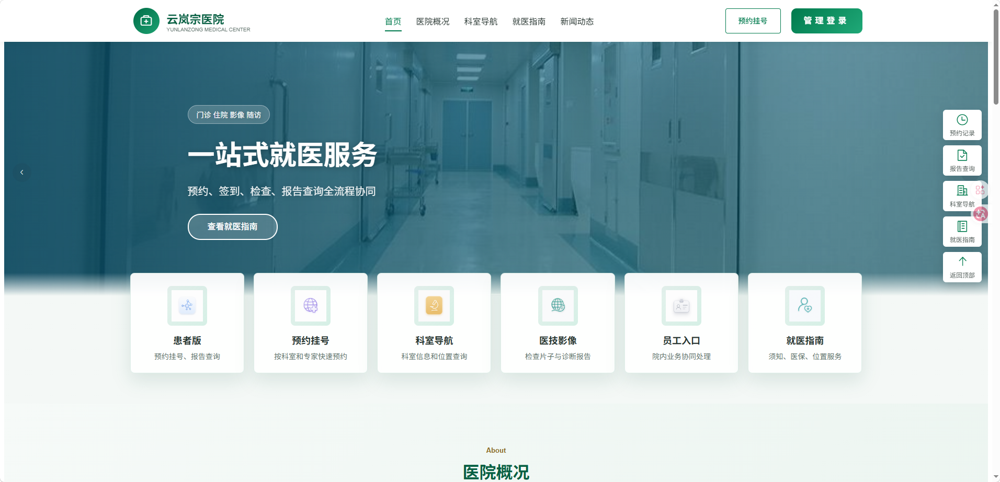
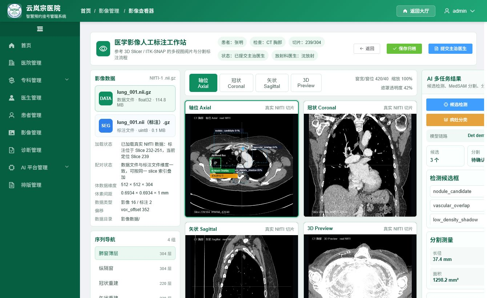
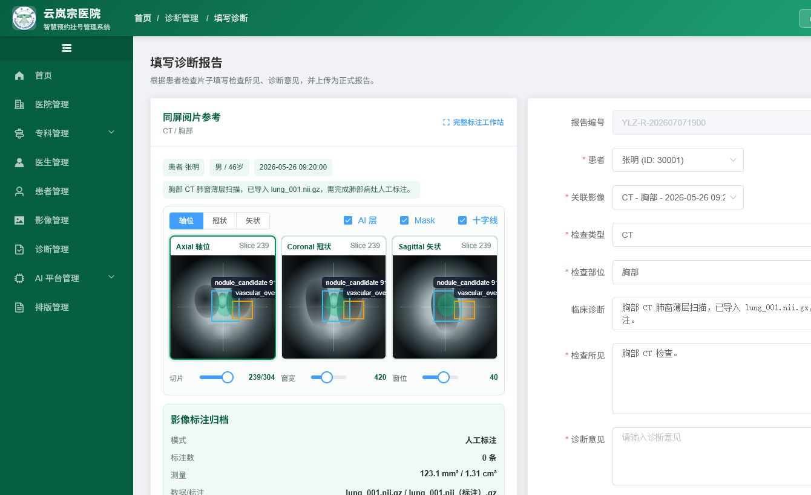
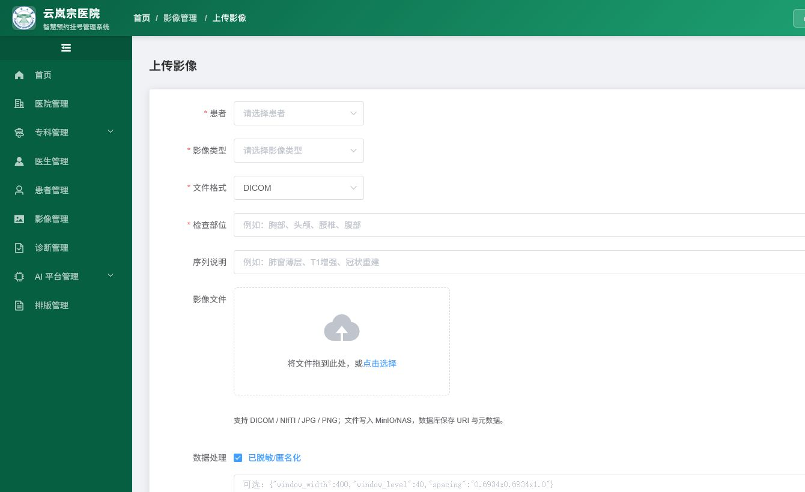
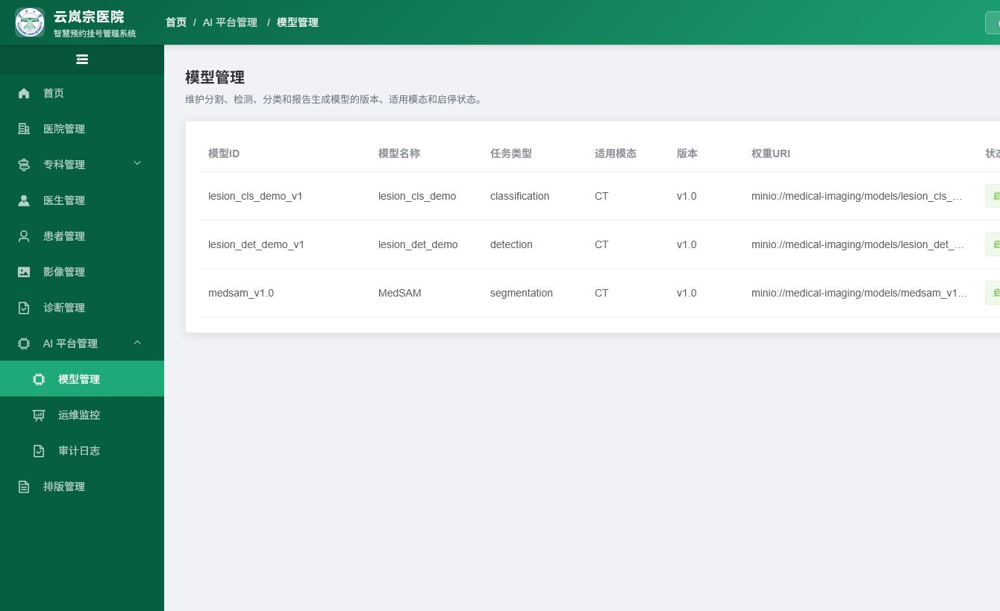
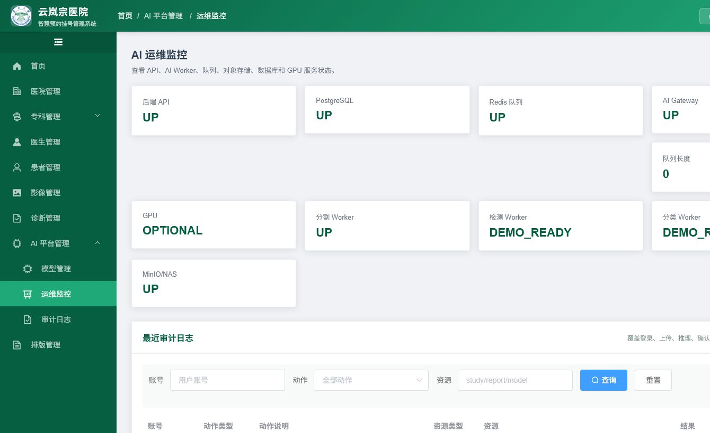
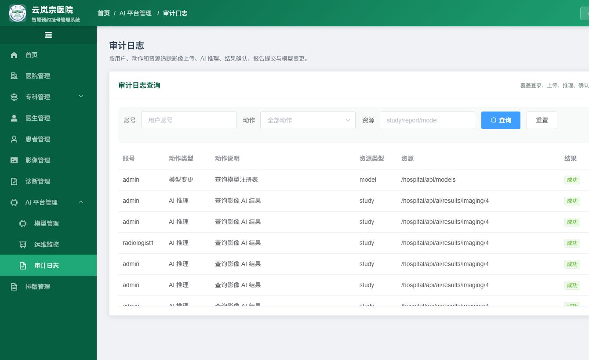

# 医学影像多模态多任务辅助标注与诊断支持系统

[](LICENSE)
[](https://www.java.com/)
[](https://vuejs.org/)
[](https://spring.io/projects/spring-boot)
[](https://www.postgresql.org/)
[](https://www.python.org/)

基于医院预约挂号管理系统的增量演进项目，扩展医学影像多模态数据管理、AI 辅助标注、诊断支持、模型管理、审计追踪与运维监控能力。系统遵循 **"AI 辅助、医生负责"** 原则 —— AI 结果仅作为参考，最终诊断由主治医生签名提交。

---

## 目录

- [项目概述](#项目概述)
- [界面预览](#界面预览)
- [系统架构](#系统架构)
- [核心能力](#核心能力)
- [技术栈](#技术栈)
- [环境要求](#环境要求)
- [快速开始](#快速开始)
- [测试账号](#测试账号)
- [项目结构](#项目结构)
- [数据库设计](#数据库设计)
- [API 接口文档](#api-接口文档)
- [前端页面说明](#前端页面说明)
- [开发指南](#开发指南)
- [常见问题](#常见问题)
- [License](#license)

---

## 项目概述

本项目原为医院预约挂号管理系统，依据《医学影像多模态多任务辅助标注系统_软件开发档案》进行增量改造，在保留原有 **Vue2 + Element UI + Spring Boot + MyBatis** 技术路线的基础上，新增以下能力：

| 新增模块 | 说明 |
|---------|------|
| **Study-Series-Instance 标准影像模型** | 兼容 DICOM/NIfTI/JPG/PNG 多模态数据，数据库存 URI + 元数据 |
| **AI 推理任务编排** | 统一 Worker 协议接入检测、分割（MedSAM）、分类和报告草稿生成 |
| **医学影像工作站** | 四视图 Viewer、人工标注（框选/点选/轮廓/补画/擦除/测量）、Mask Overlay |
| **结构化报告** | AI 草稿 + 医生确认，影像所见与诊断意见责任分离 |
| **模型管理** | 模型注册、版本管理、权重 URI、启停控制 |
| **审计日志** | 上传/推理/确认/提交/模型变更全链路追溯 |
| **运维监控** | API、AI Worker、队列、PostgreSQL、对象存储健康状态 |

---

## 界面预览

> 以下截图来自当前项目本地运行界面，放置在 `docs/screenshots/` 目录，便于在 GitHub 首页直接查看系统效果。

### 医院大厅与影像工作站

| 医院大厅首页 | 医学影像 Viewer |
|---|---|
|  |  |

### 诊断报告与影像上传

| 看片 + 报告填写 | 影像上传 |
|---|---|
|  |  |

### AI 平台管理

| 模型管理 | 运维监控 | 审计日志 |
|---|---|---|
|  |  |  |

---

## 系统架构

```
┌────────────────────────────────────────────────────────────────────────┐
│                        前端 (Vue 2.5 + Element UI)                      │
│  ┌──────────┐ ┌──────────┐ ┌──────────┐ ┌──────────┐ ┌──────────┐     │
│  │ 管理员端  │ │ 医生端   │ │ 放射科端  │ │ 患者端   │ │ 运维监控  │     │
│  └────┬─────┘ └────┬─────┘ └────┬─────┘ └────┬─────┘ └────┬─────┘     │
│       └────────────┴────────────┴────────────┴────────────┘            │
│                    Element UI + Vue Router + Vuex + Viewer             │
└──────────────────────────────┼─────────────────────────────────────────┘
                               │ HTTP (JWT Auth)
┌──────────────────────────────┼─────────────────────────────────────────┐
│                    后端 (Spring Boot 2.1.6)                            │
│  ┌───────────────────────────┴──────────────────────────────┐          │
│  │              Spring Security + JWT 认证                    │          │
│  ├────────────────┬────────────────┬─────────────────────────┤          │
│  │   业务控制器     │   AI 编排层    │      公共服务            │          │
│  │ StudyController │ AiController  │  AuditLogService       │          │
│  │ ReportController│ InferenceSvc  │  ObjectStorageAdapter  │          │
│  │ ModelController │ WorkerClient  │  OpsMonitorService     │          │
│  └───────┬────────┴───────┬────────┴───────────┬─────────────┘          │
│          │                │                    │                        │
│    ┌─────┴─────┐   ┌──────┴──────┐    ┌───────┴───────┐                │
│    │ MyBatis   │   │ AI Gateway  │    │ Storage Adapter│               │
│    └─────┬─────┘   └──────┬──────┘    └───────┬───────┘                │
│          │                │                    │                        │
└──────────┼────────────────┼────────────────────┼────────────────────────┘
           │                │                    │
  ┌────────┴─────┐  ┌───────┴────────┐  ┌───────┴──────────┐
  │ PostgreSQL   │  │  medsam-service │  │ MinIO / NAS /    │
  │ (结构数据)    │  │  + Demo Worker  │  │ 本地文件适配器    │
  └──────────────┘  └────────────────┘  └──────────────────┘
```

### AI 推理流程

```
前端创建任务 → 后端 inference_job → AI Gateway 路由 → Worker 推理
                  ↓                                        ↓
            返回 job_id                              保存结果到 DB
                  ↓                                        ↓
         前端轮询状态 ← status=completed ←── 写入 results 表
```

AI 结果仅作为辅助参考，不自动提交最终诊断。检测和分类在课程展示阶段可使用 deterministic demo worker 保证业务闭环，后续可替换为真实模型权重。

---

## 核心能力

### 四角色权限系统

| 角色 | 说明 | 主要功能 | 权限边界 |
|------|------|---------|---------|
| **管理员** | 系统管理 | 医院/科室/医生管理、模型管理、审计日志、运维监控 | 不能代替医生提交诊断 |
| **主治医生** | 临床诊断 | 看片 + AI 参考、填写诊断意见、签名提交报告 | 对最终诊断负责 |
| **放射科医生** | 影像诊断 | 四视图 Viewer、AI 推理、人工标注、生成影像所见 | 不能填写最终诊断意见 |
| **患者** | 就医服务 | 预约挂号、查看预约、报告查询（仅已提交） | 不查看未确认 AI 中间结果 |

### 影像数据模型

采用 **Study → Series → Instance** 三级标准模型，兼容 DICOM/NIfTI/JPG/PNG 多模态数据。

- **studies** — 一次检查的主记录（患者、模态、部位、状态）
- **series** — 检查下的序列或重建视图（方向、切片数）
- **instances** — 具体切片或实例文件（object_uri、元数据 JSON）

数据库只保存结构化元数据和对象存储 URI，大体积影像文件通过 MinIO/NAS/本地适配器管理。

### AI 多任务能力

| 任务 | 输入 | 输出 | 医生操作 |
|------|------|------|---------|
| **检测** | 影像实例或序列 | 候选框、标签、置信度 | 采纳 / 驳回 / 转 Box Prompt |
| **分割** | 影像 + Box/Point Prompt | Mask、Overlay、面积、体积、长径、短径 | 确认 / 修正 / 补画 / 擦除 |
| **分类** | ROI 或分割区域 | 分类标签、概率、模型版本 | 采纳或仅参考 |
| **报告草稿** | 患者+影像+AI结果 | 影像所见和辅助印象 | 主治医生最终修改签名 |

---

## 技术栈

### 后端

| 技术 | 版本 | 说明 |
|------|------|------|
| Java | 8+ | 运行环境 |
| Spring Boot | 2.1.6 | Web 框架 |
| Spring Security | — | 认证授权 |
| JWT | — | 令牌认证 |
| MyBatis | — | ORM 框架 |
| PostgreSQL | 15+ | 主数据库（推荐） |
| Redis | 6.0+ | 缓存/Session |
| MinIO | — | 对象存储（生产） |
| Maven | 3.6+ | 依赖管理 |
| Swagger | — | API 文档 |

### 前端

| 技术 | 版本 | 说明 |
|------|------|------|
| Node.js | 16.20.2 | 运行环境（**必须是 16.x**） |
| Vue.js | 2.5 | 前端框架 |
| Element UI | 2.13+ | UI 组件库 |
| Vue Router | 3.x | 路由管理（4 套角色路由） |
| Vuex | 3.x | 状态管理 |
| Axios | 0.19 | HTTP 客户端 |
| Webpack | 3.6 | 模块打包工具 |
| Cornerstone.js | 2.6 | DICOM 医学影像渲染引擎 |
| DICOM Parser | 1.8 | DICOM 文件解析库 |

### AI 服务

| 技术 | 版本 | 说明 |
|------|------|------|
| Python | 3.9+ | 运行环境 |
| Flask | 2.3.3 | Web 框架 |
| MedSAM | 1.0 | 医学图像分割模型（课程阶段预留接口） |
| Demo Worker | — | 课程展示确定性 Worker，保证业务闭环 |

---

## 环境要求

| 软件 | 最低版本 | 说明 |
|------|---------|------|
| JDK | 1.8+ | Java 运行环境 |
| Maven | 3.6+ | 项目构建 |
| Node.js | 16.x | **必须是 16.x**，不兼容 18/20/24 |
| npm | 8.x+ | 包管理 |
| PostgreSQL | 15+ | 主数据库 |
| Redis | 6.0+ | 缓存服务 |
| Python | 3.9+ | AI 服务（可选） |

---

## 快速开始

### 1. 克隆项目

```bash
git clone https://github.com/enterzxk/hospitalsystem.git
cd hospitalsystem
```

### 2. 数据库初始化

**PostgreSQL：**

```bash
# 创建数据库
createdb -U postgres hospital

# 导入数据
psql -U postgres -d hospital -f hospital/src/main/resources/rebuild_database_final.sql
```

### 3. 配置 Redis

确保 Redis 服务已启动，默认配置：
- 地址：`localhost:6379`
- 密码：`password`

如需修改，编辑 `hospital/src/main/resources/application.yml`。

### 4. 配置对象存储

默认使用本地文件适配器，存储路径在 `application.yml` 中配置。生产环境可切换为 MinIO 或 NAS：

```yaml
storage:
  type: local          # local / minio / nas
  local:
    base-path: ./data
```

### 5. 启动后端

```bash
cd hospital
mvn spring-boot:run
```

后端启动后：
- API 地址：http://localhost:8080/hospital
- Swagger 文档：http://localhost:8080/hospital/swagger-ui.html（用户名/密码：`hospital`）

### 6. 启动前端

```bash
cd hospital-web

# ⚠️ 必须使用 Node.js 16.x
nvm use 16.20.2

npm install
npm run dev
```

前端启动后访问：http://localhost:8082

### 7. 启动 AI 服务（可选）

```bash
cd medsam-service
python -m venv venv
# Windows: venv\Scripts\activate
# Linux/Mac: source venv/bin/activate
pip install -r requirements.txt
python app.py
```

---

## 测试账号

| 账号 | 密码 | 角色 | 说明 |
|------|------|------|------|
| `admin` | `123456` | 管理员 | 系统管理、模型管理、审计运维 |
| `doctor1` | `123456` | 主治医生 | 看片诊断、报告提交 |
| `radiologist1` | `123456` | 放射科医生 | 影像查看、标注、AI 分割 |
| `patient1` | `123456` | 患者 | 预约挂号、报告查询 |

> 角色识别：登录后根据用户名前缀自动路由到对应界面。

---

## 项目结构

```
hospitalsystem/
├── hospital/                              # 后端 Spring Boot 项目
│   ├── src/main/java/cn/yujian95/hospital/
│   │   ├── controller/                    # REST 控制器
│   │   │   ├── StudyController.java              # 标准影像管理
│   │   │   ├── SeriesController.java             # 序列查询
│   │   │   ├── InstanceController.java           # 实例与渲染
│   │   │   ├── AiController.java                 # AI 推理编排
│   │   │   ├── PromptController.java             # Prompt 管理
│   │   │   ├── ReportController.java             # 结构化报告
│   │   │   ├── ModelRegistryController.java      # 模型管理
│   │   │   ├── AuditLogController.java           # 审计日志
│   │   │   ├── OpsMonitorController.java         # 运维监控
│   │   │   ├── MedicalImagingController.java     # 旧影像兼容
│   │   │   ├── ImagingAnnotationController.java  # 标注管理
│   │   │   ├── DiagnosisReportController.java    # 诊断报告
│   │   │   └── ...                               # 基础业务控制器
│   │   ├── service/                       # 业务逻辑层
│   │   │   ├── impl/
│   │   │   │   ├── StudyServiceImpl.java         # 影像数据服务
│   │   │   │   ├── InferenceServiceImpl.java     # AI 推理编排
│   │   │   │   ├── ReportServiceImpl.java        # 报告工作流
│   │   │   │   └── ...
│   │   │   └── ...
│   │   ├── mapper/                        # MyBatis 映射接口
│   │   ├── entity/                        # 实体类（含 studies/series/instances 等）
│   │   ├── dto/                           # 数据传输对象
│   │   └── component/                     # 组件（对象存储适配器等）
│   ├── src/main/resources/
│   │   ├── application.yml                # 应用配置
│   │   ├── append_new_tables.sql          # 新增 AI 表结构
│   │   └── cn/yujian95/hospital/mapper/   # MyBatis XML 映射
│   └── pom.xml
│
├── hospital-web/                          # 前端 Vue 项目
│   ├── src/
│   │   ├── api/                           # API 接口封装
│   │   │   ├── imaging.js                 # 影像管理
│   │   │   ├── ai.js                      # AI 推理
│   │   │   ├── diagnosis.js              # 诊断报告
│   │   │   └── ...
│   │   ├── view/                          # 页面组件
│   │   │   ├── imagingManagement/         # 影像管理
│   │   │   │   ├── imagingList.vue        # 影像列表
│   │   │   │   ├── imagingViewer.vue      # 影像查看器（四视图+标注）
│   │   │   │   ├── imagingUpload.vue      # 影像上传
│   │   │   │   └── radiologistDashboard.vue # 放射科工作台
│   │   │   ├── diagnosisManagement/       # 诊断管理
│   │   │   ├── aiPlatform/               # AI 平台
│   │   │   │   ├── modelManagement.vue    # 模型管理
│   │   │   │   ├── auditLog.vue           # 审计日志
│   │   │   │   └── opsMonitor.vue         # 运维监控
│   │   │   └── ...
│   │   ├── router/index.js               # 路由配置
│   │   └── store/                        # Vuex 状态管理
│   ├── package.json
│   └── vue.config.js
│
├── medsam-service/                        # AI 分割服务（Python Flask）
│   ├── app.py                             # Flask 入口
│   ├── requirements.txt
│   └── Dockerfile
│
├── 前端展示/                              # 前端运行截图
│   ├── 大厅界面1.png
│   ├── 患者界面.png
│   └── 放射科医生界面.png
│
├── README.md
├── LICENSE
└── .gitignore
```

---

## 数据库设计

系统包含 **30+ 张数据表**，分为以下几类：

### 权限管理表

| 表名 | 说明 |
|------|------|
| `power_account` | 用户账号表 |
| `power_role` | 角色表 |
| `power_menu` | 菜单表 |
| `power_resource` | 资源（权限）表 |

### 标准影像数据表（新增）

| 表名 | 核心字段 | 说明 |
|------|---------|------|
| `studies` | study_id, patient_id, modality, body_part, status | 一次检查的主记录 |
| `series` | series_id, study_id, description, orientation, slice_count | 序列或重建视图 |
| `instances` | instance_id, series_id, slice_index, object_uri, metadata_json | 切片/实例文件 |

### AI 任务与结果表（新增）

| 表名 | 核心字段 | 说明 |
|------|---------|------|
| `model_registry` | model_id, task_type, version, weight_uri, status | 模型注册与版本管理 |
| `inference_jobs` | job_id, task_type, model_id, input_json, status, error_message | 推理任务记录 |
| `prompts` | prompt_id, instance_id, type, coords_viewer, coords_image | 交互提示与坐标 |
| `segmentation_results` | result_id, job_id, mask_uri, area, volume, long_axis | 分割结果 |
| `detection_results` | result_id, job_id, bbox, label, score, confirm_status | 检测候选框 |
| `classification_results` | result_id, job_id, label, probability, model_version | 分类概率 |

### 报告与业务表

| 表名 | 说明 |
|------|------|
| `diagnosis_report` | 结构化诊断报告 |
| `report_imaging_relation` | 报告-影像关联 |
| `medical_imaging` | 旧影像兼容列表 |
| `imaging_annotation` | 人工标注数据 |

### 审计与日志表（新增）

| 表名 | 说明 |
|------|------|
| `audit_logs` | 关键操作审计日志（上传/推理/确认/提交/模型变更） |
| `log_account_login` | 登录日志 |
| `log_operation` | 操作日志 |

---

## API 接口文档

> **基础路径：** `http://localhost:8080/hospital`
>
> **认证方式：** `Authorization: Bearer <JWT Token>`

### 影像数据（新增）

| 方法 | 路径 | 说明 |
|------|------|------|
| POST | `/api/studies/upload` | 上传影像并创建 Study-Series-Instance |
| GET | `/api/studies/{id}` | 查询检查详情 |
| GET | `/api/studies/{id}/series` | 查询序列列表 |
| GET | `/api/series/{id}/instances` | 查询实例列表 |
| GET | `/api/instances/{id}/render` | 渲染实例影像 |

### AI 推理（新增）

| 方法 | 路径 | 说明 |
|------|------|------|
| POST | `/api/prompts` | 保存框选/点选/轮廓 Prompt |
| POST | `/api/ai/infer/segmentation` | 创建 MedSAM 分割任务 |
| POST | `/api/ai/infer/detection` | 创建检测任务 |
| POST | `/api/ai/infer/classification` | 创建分类任务 |
| GET | `/api/ai/jobs/{job_id}` | 查询任务进度与结果 |
| POST | `/api/results/{id}/confirm` | 确认/驳回/修正 AI 结果 |

### 报告与模型（新增）

| 方法 | 路径 | 说明 |
|------|------|------|
| POST | `/api/reports/draft` | 生成结构化报告草稿 |
| POST | `/api/reports/{id}/submit` | 提交最终报告 |
| GET/POST/PUT | `/api/models` | 模型注册与版本管理 |

### 审计与运维（新增）

| 方法 | 路径 | 说明 |
|------|------|------|
| GET | `/api/audit-logs` | 查询审计日志（按用户/动作/资源筛选） |
| GET | `/api/ops/status` | 查询服务健康状态 |

### 基础业务接口

| 方法 | 路径 | 说明 |
|------|------|------|
| GET | `/power/account/login` | 用户登录 |
| GET | `/power/account/info` | 获取用户信息 |
| GET | `/hospital/info/list` | 获取医院列表 |
| GET | `/hospital/special/list` | 获取科室列表 |
| GET | `/hospital/doctor/list` | 获取医生列表 |
| POST | `/visit/appointment/create` | 创建预约 |
| PUT | `/visit/appointment/cancel/{id}` | 取消预约 |

---

## 前端页面说明

### 管理员端
- 医院管理、科室管理、医生管理、患者管理
- **模型管理** — 注册模型、管理版本、启停控制
- **审计日志** — 关键操作追溯，按用户/动作/资源筛选
- **运维监控** — API/Worker/队列/数据库/对象存储状态

### 主治医生端
- 影像查看（看片）、AI 参考面板
- **诊断书写** — 看片与报告填写合并，AI 结果仅作参考
- 出诊计划、患者管理

### 放射科医生端
- **放射科工作台** — 待诊断任务、工作统计
- **影像查看器** — 四视图（轴位/冠状/矢状/3D）、窗宽窗位、缩放
- **人工标注** — 框选、点选、轮廓、补画、擦除、测量
- AI 检测/分割/分类任务触发
- 影像所见整理与报告草稿

### 患者端
- 预约挂号向导（选科室→选医生→选时间→确认）
- 我的预约、就诊记录
- **报告查询** — 仅查看已提交报告，不显示未确认 AI 中间结果
- 缴费记录、科室介绍、个人信息

---

## 开发指南

### 后端

```bash
cd hospital
mvn test                          # 运行测试
mvn clean package                 # 打包
mvn clean package -DskipTests     # 跳过测试打包
```

### 前端

```bash
cd hospital-web
npm run dev                       # 开发模式（热重载）
npm run build-dev                 # 生产构建
```

### AI 服务

```bash
cd medsam-service
pip install -r requirements.txt
python app.py                     # 开发模式
gunicorn -w 4 -b 0.0.0.0:5000 app:app  # 生产部署
```

### Docker 部署

```bash
# AI 服务
cd medsam-service && docker build -t medsam-service . && docker run -p 5000:5000 medsam-service

# Docker Compose（全栈）
docker-compose up -d
```

---

## 常见问题

### Q1: 前端启动报错 `Node.js version incompatible`

项目要求 Node.js 16.x。使用 nvm-windows 切换：
```bash
nvm use 16.20.2
node -v  # 应显示 v16.20.2
```

### Q2: 数据库为什么使用 PostgreSQL？

开发档案要求采用 PostgreSQL。当前 `application.yml` 默认连接 `jdbc:postgresql://localhost:5432/hospital_imaging`，用于保存医院业务数据、标准影像元数据、AI 推理任务、结果表和审计日志。

### Q3: AI 服务启动报缺少模型权重

课程展示阶段使用 deterministic demo worker 保证业务闭环。真实 MedSAM 权重属于后续部署方向，不影响前端+后端+数据库链路的完整演示。

### Q4: 影像查看器无法显示

1. 确认影像文件已上传至服务器
2. 检查浏览器控制台 Canvas 渲染错误
3. 确认后端 `/api/instances/{id}/render` 接口返回正常

### Q5: AI 结果为什么不能直接进入最终诊断？

系统设计遵循 **"AI 辅助、医生负责"** 原则。AI 可以完成候选检测、分割、分类和报告草稿，但诊断意见必须由主治医生填写并签名，这是医疗责任边界的重要体现。

---

## License

MIT License

Copyright (c) 2024-2026

---

## 致谢

- [base-service](https://github.com/YuJian95/base-service) — 后端脚手架
- [hospital](https://github.com/YuJian95/hospital) — 原始后端
- [hospital-web](https://github.com/YuJian95/hospital-web) — 原始前端
- [MedSAM](https://github.com/bowang-lab/MedSAM) — 医学图像分割模型
- [Cornerstone.js](https://cornerstonejs.org/) — DICOM 渲染引擎
- [Element UI](https://element.eleme.cn/) — Vue 2.0 UI 组件库
